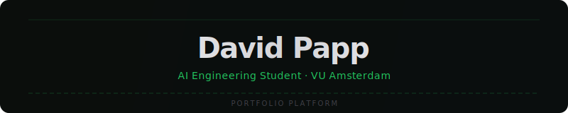
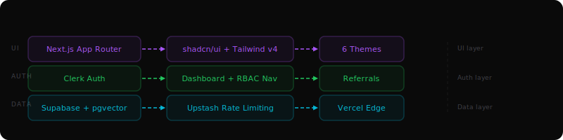

<div align="center">
  
</div>

<br/>

<div align="center">


[](https://davidpapp.dev)
[](https://www.linkedin.com/in/dávid-papp)
[](mailto:contact@davidpapp.dev)
[](https://calendly.com/david-webinform/30min)

</div>

---

## About

BSc AI student at VU Amsterdam building production-quality LLM tooling. This repo is my personal portfolio platform — designed, built, and deployed as a project in its own right rather than as a template clone.

The platform hosts four AI engineering projects under one roof: an agent observability layer, a RAG-powered chat interface with conditional 3D rendering, a codebase-to-fine-tune dataset pipeline, and the portfolio itself. Each project runs as a public product page and a protected dashboard backed by real infrastructure (Supabase, Upstash, Clerk).

I built this to demonstrate full-stack AI engineering end to end: from the LLM API surface and rate-limiting middleware all the way through auth, database schema, and Vercel edge deployment.

Looking for junior AI/automation or data science roles in the Netherlands.

---

## Architecture

<div align="center">
  
</div>

The platform is structured around three independent layers:

- **UI layer** — Next.js 16 App Router with React 19 server components. Styling via Tailwind CSS v4 and shadcn/ui. Six interchangeable themes (Vercel, Claude, Supabase, Neobrutualism, Mono, Notebook) stored in a cookie and applied at the root via a `data-theme` attribute.
- **Auth layer** — Clerk handles all authentication, organisation management, RBAC, and billing. The middleware (`src/proxy.ts`) protects `/dashboard` routes. A `useFilteredNavItems()` hook is wired in to filter nav items by Clerk organisation role; no nav entries currently declare a role gate, so the hook is a no-op until roles are added to `src/config/nav-config.ts`.
- **Data layer** — Supabase (Postgres + pgvector + Row Level Security) for persistent storage. Upstash Redis for sliding-window rate limiting. All API routes validate against both layers before touching OpenAI or HuggingFace.

---

## Features

### Public Site
- **Landing page** — animated hero, headline stats strip (systems shipped, API cost reduction, injection incidents, p99 latency), and project pillar cards
- **Product pages** — `/mcp`, `/training`, `/chat` — standalone marketing pages per project with architecture diagrams
- **Showcase** — `/projects` index plus `/projects/{slug}` deep-dive write-ups with tech stack, architecture SVGs, and links
- **SaaS Projects** — `/saas-projects` — curated list synced from external sources via `scripts/sync-saas-projects.mjs`
- **About page** — bio, education, skills with proficiency levels and evidence links, availability/contact
- **Brand** — `/brand` — design system, type scale, colour tokens, scroll-spy navigation
- **Static pages** — `/privacy-policy`, `/terms-of-service`, `/security`

### Dashboard (auth required)
- **Overview** — stats cards (MCP calls, datasets, active API keys, chat sessions placeholder) sourced from Supabase, alongside three parallel route slots (`@area_stats`, `@bar_stats`, `@pie_stats`) with independent loading and error isolation. There is no `overview/page.tsx` — `overview/layout.tsx` owns the shell and the parallel slots render in place.
- **MCP dashboard** — create/revoke API keys, inspect live event log with guard outcomes
- **Training dashboard** — upload datasets, trigger LoRA fine-tune jobs, monitor job status
- **Referrals** — generate referral links, track click events, view conversion data
- **Profile** — full Clerk account management (passwordless, social logins, passkeys)
- **Admin** — internal panel showing company usage stats, demo quotas, event breakdowns (Supabase-backed)
- **RBAC navigation hook** — `useFilteredNavItems()` will filter sidebar items by Clerk organisation role once entries declare role gates (none do today)
- **KBar** — `⌘K` command palette for keyboard navigation

### Infrastructure
- **Rate limiting** — four sliding-window limiters via Upstash: `chatRateLimit` (10/hr anon), `chatAuthRateLimit` (50/hr), `mcpRateLimit` (100/min), `trainingRateLimit` (5/hr)
- **Demo quota system** — company-scoped quotas (`companies`, `demo_quotas`, `demo_events`) used by `/api/demo-quota` and the MCP/training demo endpoints
- **Referral system** — `/r/[token]` route handler, Supabase-backed event tracking via `/api/ref` and `/api/ref/events`
- **AMA endpoint** — `/api/ama` answers questions from a hand-curated corpus in `src/lib/ama/corpus.ts`
- **HMAC signing** — MCP API key verification via `MCP_HMAC_SECRET`
- **Design tokens** — seven OKLCH theme files ship in `src/styles/themes/`. They're not surfaced via a user-facing switcher on production today; the live site renders the `davidpapp` palette only.

---

## Projects

### MCP Sentinel — Agent Observability Layer

**[Live →](https://davidpapp.dev/projects/mcp-sentinel)** | **[Dashboard →](https://davidpapp.dev/dashboard/mcp)**

A guard layer that sits between an AI agent and its MCP tool calls. Every request passes through a chain of guards before being forwarded:

| Guard | What it does |
|---|---|
| Rate Limiter | Sliding-window quota per API key (Upstash Redis) |
| Injection Detector | Pattern-match + heuristic prompt injection detection |
| PII Scanner | Regex + NER-based scan for emails, phone numbers, credentials |
| Cost Limit | Per-key budget cap to short-circuit runaway tool loops |

All events — pass and block — are written to Supabase (`mcp_events` table) and surfaced in the dashboard with guard outcome, timestamp, and payload hash. API keys are HMAC-signed and stored with RLS enforced per user. Wrapper-style architecture keeps overhead at p99 < 12ms.

**Stack:** Next.js API routes · Supabase (mcp_api_keys, mcp_events) · Upstash Redis · HMAC signing

---

### RAG + 3D Chat — Retrieval-Augmented Chat Interface

**[Live →](https://davidpapp.dev/projects/rag-chat)** | **[Try it →](https://davidpapp.dev/chat)**

A retrieval-augmented chat interface with a conditional Three.js rendering layer. Current pipeline (see [`src/lib/chat/rag.ts`](src/lib/chat/rag.ts)):

1. **Chunking** — `chunkText()` splits source text on blank lines and packs paragraphs up to a target chunk size
2. **Retrieval** — `retrieveChunks()` scores chunks by query-word overlap and returns the top-K matches
3. **Generation** — retrieved chunks are passed to the chat model as context
4. **3D layer** — when the model emits spatial/graph data, a Three.js scene (`src/lib/scene/`) renders alongside the text via `@react-three/fiber`

Unauthenticated users hit `chatRateLimit` (10/hr); authenticated users hit `chatAuthRateLimit` (50/hr). The Thesys C1 / Crayon components handle the streaming UI.

> **Roadmap:** swap the keyword retriever for `text-embedding-3-small` + Supabase `pgvector` once the corpus grows past what term-overlap can handle.

**Stack:** OpenAI API (chat) · keyword retrieval over chunked corpus · Upstash Redis · Three.js + @react-three/fiber · Thesys C1 + Crayon

---

### Training Pipeline — Codebase → LoRA Dataset

**[Live →](https://davidpapp.dev/projects/training)** | **[Dashboard →](https://davidpapp.dev/dashboard/training)**

An end-to-end pipeline for turning a Git repository into a fine-tuning dataset for LoRA adapters:

1. **Ingestion** — repository files are parsed; AST-aware chunking splits by function/class boundary rather than token count
2. **Prompt generation** — each chunk is paired with an instruction prompt using a template library
3. **JSONL formatting** — output written as `{"instruction": ..., "input": ..., "output": ...}` per HuggingFace convention
4. **Validation** — length filtering, deduplication, format checks
5. **Fine-tune job** — dataset uploaded to HuggingFace Hub; job dispatched to the fine-tune API; status polled and stored in Supabase (`training_jobs` table)

All steps are rate-limited at 5 jobs/hr per user (`trainingRateLimit`).

**Stack:** HuggingFace Hub API · JSONL · AST parsing · Supabase (datasets, training_jobs) · Upstash Redis

---

### Portfolio Platform — This Repo

**[Live →](https://davidpapp.dev/projects/portfolio)**

The infrastructure behind all four projects above. Notable design decisions:

- **Middleware** lives in `src/proxy.ts` (not `middleware.ts`) to satisfy Next.js 16 App Router conventions
- **Parallel routes** on the overview dashboard (`@area_stats`, `@bar_stats`, etc.) allow independent loading states and error boundaries without lifting state
- **RLS on every table** — Supabase Row Level Security ensures API routes using the service role key cannot leak cross-user data even if application logic has a bug
- **Theme cookie** — active theme persisted in `active_theme` cookie, read server-side on first render to avoid flash

**Stack:** Next.js 16 · Clerk · Supabase (6 tables + RLS) · Upstash · Tailwind CSS v4 · Vercel

---

## Route Structure

```
src/app/
├── (marketing)/
│   └── layout.tsx                  # Currently unused — empty route group, landing lives in (public)
├── (public)/                       # Public marketing + product pages
│   ├── layout.tsx
│   ├── page.tsx                    # Landing page → /
│   ├── mcp/page.tsx                # MCP Sentinel product page → /mcp
│   ├── training/page.tsx           # Training Pipeline product page → /training
│   ├── chat/page.tsx               # RAG Chat product page → /chat
│   ├── projects/
│   │   ├── page.tsx                # Showcase index → /projects
│   │   ├── mcp-sentinel/page.tsx
│   │   ├── rag-chat/page.tsx
│   │   ├── training/page.tsx
│   │   └── portfolio/page.tsx
│   ├── saas-projects/page.tsx      # SaaS portfolio → /saas-projects
│   ├── about/page.tsx
│   ├── brand/page.tsx              # Brand & design system → /brand
│   ├── security/page.tsx
│   ├── privacy-policy/page.tsx
│   └── terms-of-service/page.tsx
├── dashboard/                      # Protected by Clerk (proxy.ts)
│   ├── layout.tsx                  # Sidebar + KBar + InfoSidebar shell
│   ├── page.tsx                    # /dashboard root
│   ├── overview/                   # Parallel-route dashboard (no page.tsx)
│   │   ├── layout.tsx              # Owns the stats cards + slot grid
│   │   ├── error.tsx
│   │   ├── @area_stats/            # Each slot has page/loading/error/default
│   │   ├── @bar_stats/
│   │   └── @pie_stats/
│   ├── mcp/page.tsx                # API keys + event log
│   ├── training/page.tsx           # Datasets + training jobs
│   ├── referrals/page.tsx          # Referral link tracking
│   ├── profile/[[...profile]]/     # Clerk account management
│   └── admin/page.tsx              # Admin panel (Supabase company stats)
├── auth/
│   ├── layout.tsx
│   ├── page.tsx                    # Auth landing
│   ├── sign-in/[[...sign-in]]/     # Clerk sign-in (catch-all)
│   └── sign-up/[[...sign-up]]/     # Clerk sign-up (catch-all)
├── api/
│   ├── ama/route.ts                # Ask-me-anything corpus endpoint
│   ├── chat/route.ts               # RAG + streaming chat
│   ├── demo-quota/route.ts         # Demo quota lookup/decrement
│   ├── mcp/route.ts                # MCP guard layer
│   ├── mcp/demo/route.ts           # Public MCP demo endpoint
│   ├── mcp/keys/route.ts           # API key management
│   ├── mcp/events/route.ts         # Event log
│   ├── training/route.ts           # Training dataset CRUD
│   ├── training/datasets/route.ts  # Dataset management
│   ├── training/start/route.ts     # Trigger fine-tune job
│   ├── ref/route.ts                # Referral tracking
│   └── ref/events/route.ts         # Referral event log
├── r/[token]/route.ts              # Referral redirect (route handler, not page)
├── not-found.tsx
└── layout.tsx                      # Root: ThemeProvider → NuqsAdapter → ClerkProvider
```

---

## Tech Stack

| Category | Technology | Why |
|---|---|---|
| Framework | [Next.js 16](https://nextjs.org) (App Router) | Server components, parallel routes, middleware at the edge |
| Language | [TypeScript 5.7](https://www.typescriptlang.org) (strict) | Catches API shape mismatches at compile time |
| Styling | [Tailwind CSS v4](https://tailwindcss.com) | CSS-first config, OKLCH colour support for themes |
| Components | [shadcn/ui](https://ui.shadcn.com) | Unstyled primitives — own the code, not the package |
| Auth | [Clerk](https://clerk.com) | Orgs, RBAC, billing, passkeys — zero auth code to maintain |
| Database | [Supabase](https://supabase.com) (Postgres + pgvector) | RLS, vector similarity search, and real-time in one service |
| Rate limiting | [Upstash Redis](https://upstash.com) | Serverless-native sliding-window limiter, no cold starts |
| AI / Embeddings | [OpenAI API](https://platform.openai.com) | text-embedding-3-small + gpt-4o-mini for chat |
| 3D rendering | [Three.js](https://threejs.org) + [@react-three/fiber](https://r3f.docs.pmnd.rs) + [@react-three/drei](https://github.com/pmndrs/drei) | Conditional spatial data visualisation in the chat UI |
| Chat UI | [Thesys C1](https://thesys.so) + [Crayon](https://crayonai.org) (`@crayonai/react-core`, `react-ui`, `stream`) | Streaming generative UI |
| Diagrams | [Mermaid](https://mermaid.js.org) + [@xyflow/react](https://reactflow.dev) | Architecture and flow diagrams |
| Fine-tuning | [HuggingFace Hub](https://huggingface.co) | Dataset upload + LoRA fine-tune job API |
| State | URL search params via [Nuqs](https://nuqs.47ng.com) | Type-safe, shareable filter/pagination state |
| Command palette | [KBar](https://kbar.vercel.app) | `⌘K` navigation across the dashboard |
| Deployment | [Vercel](https://vercel.com) | Edge middleware, zero-config Next.js, preview deployments |
| Linting | ESLint + Prettier + Husky | Pre-commit hooks enforce format and type checks |

---

## Database Schema

Nine tables in Supabase across two migrations, all with RLS enabled:

```sql
-- 001_initial.sql
ref_links       -- user_id, token, created_at
ref_events      -- link_id, ip_hash, referrer, created_at
mcp_api_keys    -- user_id, key_hash, label, created_at, revoked_at
mcp_events      -- key_id, tool, guard_result, payload_hash, created_at
datasets        -- user_id, name, file_path, row_count, created_at
training_jobs   -- dataset_id, model, status, hf_job_id, created_at, finished_at

-- 002_demo_quota.sql
companies       -- id, name, domain (unique), created_at
demo_quotas     -- company_id, demo_type, start_at, end_at, remaining, status
demo_events     -- company_id, user_id (Clerk), demo_type, metadata, created_at
```

Migrations: [`supabase/migrations/001_initial.sql`](./supabase/migrations/001_initial.sql) · [`supabase/migrations/002_demo_quota.sql`](./supabase/migrations/002_demo_quota.sql)

---

## Getting Started

### Prerequisites

- Node.js 20+
- A [Clerk](https://clerk.com) account (free tier works; keyless mode available)
- A [Supabase](https://supabase.com) project with the migration applied
- (Optional) [Upstash](https://upstash.com) Redis database for rate limiting
- (Optional) OpenAI API key for the chat feature

### 1. Clone and install

```bash
git clone https://github.com/pappdavid/portfolio-platform.git
cd portfolio-platform
npm install
```

### 2. Configure environment

```bash
cp env.example.txt .env.local
```

Edit `.env.local`. The shipped `env.example.txt` covers the Clerk and Sentry blocks — the Supabase, Upstash, OpenAI, Thesys, and MCP variables are required but not yet templated, so add them manually:

| Variable | Required | Description |
|---|---|---|
| `NEXT_PUBLIC_CLERK_PUBLISHABLE_KEY` | Yes (or keyless) | Clerk publishable key — leave empty to use Clerk's keyless mode |
| `CLERK_SECRET_KEY` | Yes (or keyless) | Clerk secret key |
| `NEXT_PUBLIC_CLERK_SIGN_IN_URL` | Default | `/auth/sign-in` |
| `NEXT_PUBLIC_CLERK_SIGN_UP_URL` | Default | `/auth/sign-up` |
| `NEXT_PUBLIC_CLERK_AFTER_SIGN_IN_URL` | Default | `/dashboard/overview` |
| `NEXT_PUBLIC_CLERK_AFTER_SIGN_UP_URL` | Default | `/dashboard/overview` |
| `WEBHOOK_SECRET` | Optional | Clerk webhook secret (for billing/webhooks) |
| `NEXT_PUBLIC_SUPABASE_URL` | Yes | Supabase project URL |
| `NEXT_PUBLIC_SUPABASE_ANON_KEY` | Yes | Supabase anon key (public) |
| `SUPABASE_SERVICE_ROLE_KEY` | Yes | Supabase service role key (server only) |
| `UPSTASH_REDIS_REST_URL` | Optional | Upstash REST URL — disables rate limiting if absent |
| `UPSTASH_REDIS_REST_TOKEN` | Optional | Upstash REST token |
| `OPENAI_API_KEY` | Optional | Enables the RAG chat and embeddings |
| `THESYS_API_KEY` | Optional | Thesys C1 streaming UI |
| `MCP_HMAC_SECRET` | Optional | Signs MCP API keys |
| `NEXT_PUBLIC_SENTRY_DSN`, `NEXT_PUBLIC_SENTRY_ORG`, `NEXT_PUBLIC_SENTRY_PROJECT`, `SENTRY_AUTH_TOKEN` | Optional | Sentry error tracking (see `env.example.txt` for setup) |

### 3. Apply the database migrations

In your Supabase dashboard → SQL editor, run both migration files in order:

```
supabase/migrations/001_initial.sql      # ref/mcp/training tables
supabase/migrations/002_demo_quota.sql   # companies, demo_quotas, demo_events
```

This creates all nine tables with RLS enabled (the app uses the service role key server-side and bypasses RLS).

### 4. Run locally

```bash
npm run dev     # http://localhost:3000
```

---

## Development Commands

```bash
npm run dev          # Dev server with Turbopack HMR
npm run build        # Production build (type-check + static generation)
npm run start        # Serve the production build locally
npm run lint         # ESLint across src/
npm run lint:fix     # ESLint fix + Prettier format
npm run lint:strict  # Zero-warning ESLint (used in CI)
npm run format       # Prettier write
npm run format:check # Prettier check (dry run)
```

Pre-commit hooks (Husky + lint-staged) run `lint:fix` on staged files automatically.

---

## Project Structure

```
src/
├── app/                    # Next.js App Router (see Route Structure above)
├── components/
│   ├── ui/                 # shadcn/ui primitives (do not modify directly)
│   ├── layout/             # Sidebar, header, providers, info-sidebar, footer
│   ├── landing/            # Landing page sections and hero
│   ├── mcp/                # MCP product page components
│   ├── training/           # Training product page components
│   ├── chat/               # Chat product page components
│   ├── projects/           # Projects showcase page components
│   ├── saas-projects/      # SaaS portfolio page components
│   ├── ama/                # AMA section component
│   ├── kbar/               # ⌘K command palette
│   ├── shared/             # arch-diagram, code-block, mermaid-diagram, xyflow wrappers
│   └── themes/             # Theme config and switcher
├── features/
│   ├── auth/               # Sign-in/sign-up views, interactive grid background
│   ├── mcp-dashboard/      # MCP dashboard feature (API keys, event log)
│   ├── training-dashboard/ # Training dashboard (datasets, jobs)
│   ├── referrals/          # Referral dashboard feature
│   ├── overview/           # Dashboard overview graphs (area, bar, pie + skeletons)
│   └── profile/            # Profile view page (Clerk UI)
├── lib/
│   ├── supabase/
│   │   ├── client.ts       # Browser Supabase client
│   │   ├── server.ts       # Server Supabase client (service role)
│   │   └── admin.ts        # Supabase admin client (full access for API routes)
│   ├── ama/corpus.ts       # AMA corpus data
│   ├── chat/rag.ts         # RAG pipeline logic
│   ├── mcp/                # MCP server and tools definitions
│   ├── scene/              # Three.js scene setup + types (chat 3D layer)
│   ├── training/parser.ts  # Codebase AST parser for fine-tune dataset
│   ├── rate-limit.ts       # Upstash sliding-window factory functions
│   ├── company.ts          # Company/demo-quota helpers
│   ├── demo-quota.ts       # Demo quota enforcement
│   ├── metadata.ts         # Shared Next.js metadata factory
│   ├── format.ts           # Date/number formatting utilities
│   ├── parsers.ts          # URL/filter parsers
│   ├── data-table.ts       # Data table column/filter helpers
│   └── utils.ts            # cn() and shared utilities
├── hooks/
│   ├── use-nav.ts          # useFilteredNavItems — RBAC navigation filtering
│   ├── use-breadcrumbs.tsx # Breadcrumb generation from pathname
│   ├── use-callback-ref.ts / .tsx
│   ├── use-debounce.tsx
│   ├── use-debounced-callback.ts
│   ├── use-media-query.ts
│   └── use-mobile.tsx
├── config/
│   ├── nav-config.ts       # publicNavItems + navItems (dashboard sidebar)
│   └── data-table.ts       # Data table presets
├── styles/
│   ├── globals.css
│   ├── theme.css
│   └── themes/             # 7 CSS variable theme files (OKLCH)
└── types/                  # Shared TypeScript types
```

Helper scripts live in `scripts/` (e.g. `sync-saas-projects.mjs` syncs the SaaS portfolio page).

---

## Themes

> **Status:** internal only. The production site ships the `davidpapp` palette and does **not** expose a theme switcher. The other six theme files remain in the codebase as design-system references and as a starting point if a switcher is reintroduced.

Theme CSS lives in `src/styles/themes/`:

| Theme | Description |
|---|---|
| `davidpapp` | Personal brand palette — the only theme currently rendered on production |
| `vercel` | Dark — black background, white/zinc palette |
| `claude` | Warm orange accent on dark |
| `supabase` | Supabase green on dark |
| `neobrutualism` | High-contrast, thick borders, bold typography |
| `mono` | Monochrome grey scale |
| `notebook` | Light mode, paper-like background |

The runtime infrastructure (`data-theme` on `<html>` + `active_theme` cookie) is still wired in `src/components/themes/`, so reattaching a switcher is a UI-only change.

---

## Contact

Open to conversations about AI engineering, LLM tooling, or potential roles.

[contact@davidpapp.dev](mailto:contact@davidpapp.dev) · [linkedin.com/in/dávid-papp](https://www.linkedin.com/in/dávid-papp) · [davidpapp.dev](https://davidpapp.dev) · [Book a 20-min call](https://calendly.com/david-webinform/30min)
